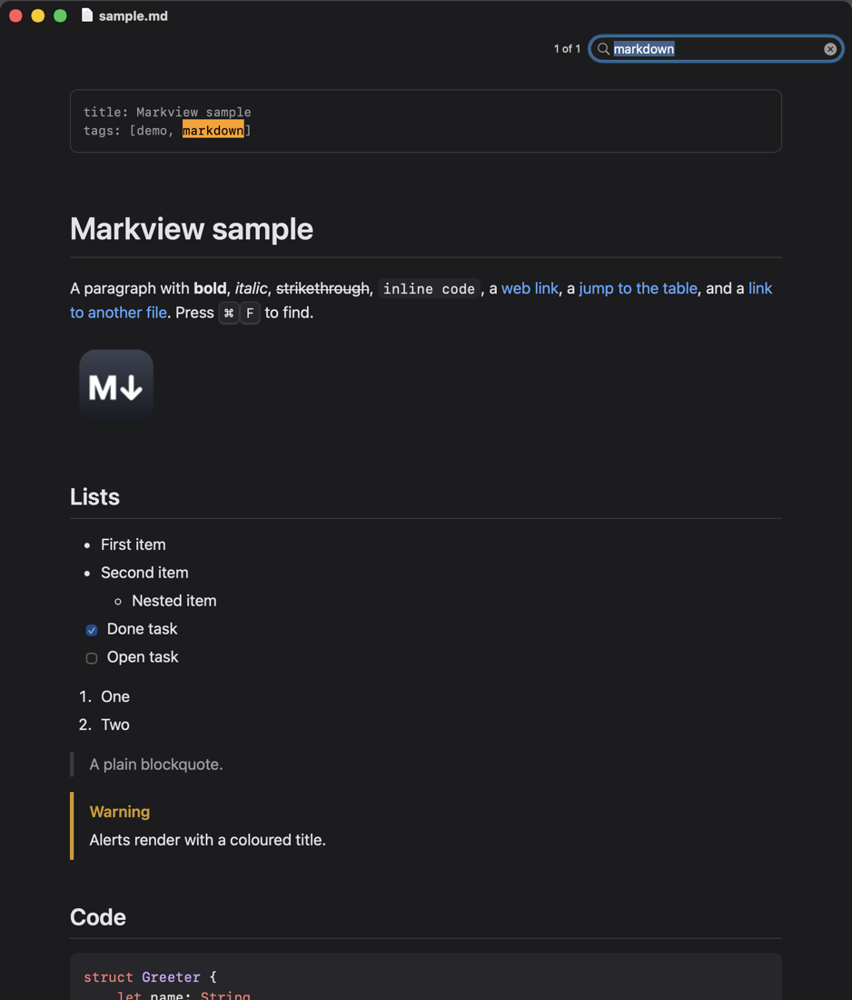

# Markview

A small native macOS viewer and editor for Markdown. Open a `.md` file and it is shown
as a page that follows the file as it changes on disk; press ⌘U to write it in an
editor beside the page, which keeps up as you type. Press Space on a Markdown file in
Finder and the same renderer draws the Quick Look preview.



## Install

```sh
brew install --cask dagurleo/tap/markview
```

or download `Markview-<version>.dmg` from [Releases](https://github.com/dagurleo/markview/releases)
and drag Markview to Applications. It is signed and notarized, and runs on macOS 14
or later. Open it once so that macOS picks up its Quick Look preview; "Make Default
Markdown Viewer" in the Markview menu has Markdown files open in it.

`markview README.md` opens files from a terminal, `markview docs` a folder, and
`some-command | markview` shows what is piped in. The Homebrew cask puts the command on the PATH; otherwise link it:
`ln -s /Applications/Markview.app/Contents/Resources/markview /usr/local/bin/markview`.

Markview updates itself through [Sparkle](https://sparkle-project.org). On its second
launch it asks whether to check for updates automatically; "Check for Updates…" in the
Markview menu checks at any time. Version 0.1.0 predates this and is updated by hand once.

## What it does

- Renders Markdown with Foundation's parser and TextKit, with no web view:
  headings, lists and task lists, tables, blockquotes and GitHub alerts, code
  blocks highlighted by highlight.js running in JavaScriptCore (56 languages), images
  (local and remote), front matter (as a table of its keys when it is simple YAML, as
  GitHub shows it), and the HTML a README tends to use (centred blocks,
  `` with a size, `<details>`, HTML tables, inline tags). Badge links
  (`[](url)`) work, and so do a README's images for light and dark windows
  (`<picture>` with `prefers-color-scheme` sources, and `#gh-light-mode-only` /
  `#gh-dark-mode-only`), which switch with the appearance.
- Draws math and diagrams natively, in the light or dark colours of the window:
  - Math is TeX between `$…$`, `$$…$$` or in a ```` ```math ```` block, as on GitHub,
    drawn by SwaTex, a Swift version of KaTeX with KaTeX's fonts, as the document
    renders: about 25 µs a formula. Equations number on through the document, and
    `\ce` writes chemistry.
  - ```` ```mermaid ```` blocks are drawn by MermaidKit: every Mermaid diagram type,
    in a few milliseconds each, just after the text shows.
  - A formula or diagram that cannot be drawn shows as written. Copying a drawn one
    copies its Markdown.
- Reads the common dialects too: footnotes, `:emoji:` shortcodes, `[[wiki links]]`
  resolved against the files around the document, `==highlights==`, Obsidian
  callouts with titles and kinds beyond GitHub's five, `{#custom-id}` on headings,
  and `:::note` or `!!! note` admonitions. Files in Latin-1 or with a byte order
  mark are read correctly.
- Keeps documents harmless. Links to other Markdown files open in Markview, web
  links go to the browser, and any other local file is only revealed in Finder,
  so a document can never launch an app or run a script. Files dropped on a
  window follow the same rules.
- Browses like a browser: a link to another Markdown file opens in the same window
  (⌘-click for a new one), and Go > Back and Forward (⌘[ ⌘], or a mouse's side
  buttons) return to the exact place left, also after following a link to a heading
  or choosing one in the outline.
- Clicking a picture shows it full size in a Quick Look panel; a Mermaid diagram opens
  as a PDF that stays sharp however far it is zoomed.
- Settings (⌘,) choose the look: twelve themes (GitHub, Solarized, One, Monokai, Dracula,
  Nord, Tokyo Night, Catppuccin, Gruvbox, Ayu, Rosé Pine and Paper), each with a light and a dark side, light or dark whatever the
  system shows, the text size, which the whole page follows, the text and code fonts,
  the line length and the line spacing. Changes show at once in open windows, and
  Quick Look previews follow them too. Printing and PDFs use the theme's light colours.
- Quick Look preview through an app extension. Links in the preview go through a
  small XPC helper because the extension's sandbox cannot open them itself.
- Edits beside the page (View > Show Editor, ⌘U): the Markdown as written, coloured in
  the theme, with the page following a moment after you stop typing. Documents always
  open as pages to read; the window widens to make room for the editor when the screen
  has it. File > New (⌘N) starts a document with the editor open. Saving is yours to do
  (⌘S, Save As…, Revert to Saved): unsaved edits are kept aside every few seconds and
  come back after a crash, but the file itself is only written when you save, in the
  encoding, byte order mark and line endings it had. If another app changes the file
  while it has unsaved edits, a bar above the editor asks which to keep. Find and
  Replace (⌥⌘F), spelling (which leaves code, addresses and tags alone) and undo work as
  in any Mac editor.
- The editor and the page keep to the same place: scroll either and the other follows,
  line for line of the Markdown, and double-clicking the page puts the insertion point on
  the line it was written on. Code in fenced blocks is coloured by language, as on the
  page. Return carries a list, a numbered list, a task list or a quote on to the next
  line, and ends it on an empty item; Tab and ⇧Tab nest and un-nest list items, lined up
  as Markdown reads them, or indent selected lines. The Format menu marks text as bold
  (⌘B), italic (⌘I), struck through (⇧⌘X), code (⌘E) or a link (⌘K). View > Show Line
  Numbers (⌥⌘L), and Settings > Editor chooses the editor's font, line numbers,
  wrapping, what Tab inserts, and spelling and substitutions.
- A sidebar beside the page (View > Show Sidebar, ⌃⌘S) with the document's headings,
  marking the section being read; clicking a heading goes to it.
- Opens folders too (File > Open…, the `markview` command, or a folder dropped on the
  Dock icon or a window): the window starts at the folder's README and lists its
  Markdown files in the sidebar, keeping up as files come and go; hidden folders and
  `node_modules` are left out.
- Reopens each document where it was last read (for the last 200 documents).
- Shows where a link leads in the corner of the window while the pointer is over it,
  puts a copy button on code blocks, and offers "Copy Link to Heading" in a heading's
  context menu (as `file.md#heading`, the way Markdown links to it).
- Find (⌘F), zoom (⌘+ ⌘- ⌘0), a Go menu listing the headings, with Next and Previous
  Heading (⌥⌘↓ ⌥⌘↑),
  Print (⌘P) and Export as PDF (⇧⌘E), Open With, Reveal in Finder (⇧⌘R), Copy
  Path (⌥⌘C), Open Recent, and "Make Default Markdown Viewer" in the app menu.
  Markdown files show Markview's document icon once it is the default app.
- Large files show their beginning at once and finish rendering in the
  background.

## Limitations

- Math is not searchable, and diagrams are not interactive.
- Diagrams follow Mermaid's syntax but MermaidKit's look, not Mermaid's. A few
  things come out imperfectly: hexagon nodes, thick arrows, class stereotypes and
  multiplicities, and dates on a Gantt chart's axis.
- Long code lines wrap (the continuation is indented) instead of scrolling sideways.
  Drawings made with box-drawing characters never wrap; they shrink to fit the
  column instead, so a very wide one comes out small.
- HTML support covers the common README elements; other tags are dropped and
  their text kept.

## Building

```sh
./build.sh            # builds build/Markview.app
./build.sh install    # copies it to /Applications and registers the Quick Look extension
```

Only the command line tools are needed: `build.sh` calls `swiftc` directly, there
is no Xcode project and no package. The first build takes two minutes longer, to
compile the vendored MermaidKit and SwaTex, which are then kept in `build/modules`,
and downloads Sparkle 2.10.0 into `build/`, checked against its published SHA-256.
The app runs on macOS 14 or later. `build.sh` signs it ad hoc, which is enough to run
it on the machine that built it.

## Releasing

```sh
scripts/release.sh
```

builds the app signed with a Developer ID certificate from the keychain (the newest,
or the one whose SHA-1 hash is in `IDENTITY`) and the hardened runtime, has Apple
notarize it and staples the ticket to it. It writes to `build/release`:
`Markview-<version>.zip` for the Homebrew cask and for Sparkle, `Markview-<version>.dmg`
for downloading (both notarized, with their SHA-256), `appcast.xml`, which tells
installed copies about the version, and `notes.md`, the version's section of
[CHANGELOG.md](CHANGELOG.md). The zip and the appcast are signed with Sparkle's key.
The script needs notarization credentials and that key stored once in the keychain:

```sh
xcrun notarytool store-credentials markview --apple-id <Apple ID> --team-id <team ID>
build/Sparkle-2.10.0/bin/generate_keys --account markview   # prints the public key for SUPublicEDKey
```

Keep a copy of the key (`generate_keys --account markview -x <file>` exports it):
without it, installed copies cannot take another update.

The version is `CFBundleShortVersionString` in `Info.plist` and the build number
`CFBundleVersion`, which Sparkle compares and so must go up with every release; the
Quick Look extension and its service take theirs from them. Write the version's
section of `CHANGELOG.md` first: the script stops without one. To publish a release,
attach the files to it on GitHub, then give the cask in
[dagurleo/homebrew-tap](https://github.com/dagurleo/homebrew-tap) the new `version` and
the zip's `sha256`:

```sh
gh release create v<version> build/release/Markview-<version>.dmg build/release/Markview-<version>.zip \
  build/release/appcast.xml --notes-file build/release/notes.md
```

Installed copies read the appcast from `releases/latest/download/appcast.xml`
(`SUFeedURL`), so the newest release must carry one.

## Layout

| Folder | Contents |
|---|---|
| `Sources/` | The app's shell: app delegate and menu, document, file watcher, link rules, folders and the document controller that opens them, the sidebar with its file and heading lists, the places documents were last read, and the Settings window (SwiftUI) |
| `Native/` | The renderer: `MarkdownView`, `NativeRenderer`, `HighlightEngine`, `Math`, `Diagrams`, `Theme` and its `Palette`s, `Settings`, the window controller and the Quick Look controller |
| `QuickLook/` | The extension's plist and entitlements, and the `LinkOpener` XPC service |
| `Resources/` | Icons, the `markview` command, and the vendored highlight.js and emoji list. `highlight.min.js` is highlight.js 11.12.0's standard build followed by 20 grammars from its `@highlightjs/cdn-assets` package (Dockerfile, PowerShell, Scala, Dart, Haskell, Elixir, Erlang, Groovy, Gradle, Protobuf, Nginx, LaTeX, CMake, Nix, Julia, Clojure, OCaml, F#, properties, Apache); to add one, append its `languages/<name>.min.js` from the same version. The Quick Look extension has its own copy of the `vendor` folder |
| `Vendor/MermaidKit/` | [MermaidKit](https://github.com/2389-research/MermaidKit) 2.2.0 (85fdc08), which draws diagrams: its `MermaidLayout` and `MermaidRender` sources as released, less `MermaidView.swift`, which needs SwiftUI. To update, copy both folders from a new release and drop that file again |
| `Vendor/SwaTex/` | [SwaTex](https://github.com/PhraseHQ/SwaTex) 0.5.0 (2b38d0b), which draws math: its `SwaTex` sources less the docs, and from `SwaTexRender` only `DisplayListRenderer.swift`, `KaTeXFontProvider.swift` and the fonts. Markview's changes are marked `Markview:` in the code: a `Mutex` that works on macOS 14, fonts read from the app, and KaTeX's `align` spacing, `\dots`, `\tag` text and placement, and equation numbering. To update, copy the same files from a new release and carry over what `grep -rn Markview: Vendor/SwaTex` finds |
| `scripts/` | `check.sh` and `compare.swift`, which compare this build's rendering with a release's; `release.sh`, which builds, notarizes and zips a release; and `make-icon.swift`, which draws the app and document icons |
| `sample/` | Documents to try: `sample.md` has a bit of everything; `text.md`, `images.md`, `tables.md`, `code.md`, `html.md`, `extensions.md`, `math.md`, `diagrams.md` and `appearance.md` (images for light and dark windows) each show one kind of element |

## Scripted checks

```sh
scripts/check.sh          # or scripts/check.sh 0.2.0
```

renders every sample with `build/Markview.app` and with a released version (the newest, or
the one named, downloaded once into `build/check`), as a PDF and as light and dark
snapshots, and compares them pixel by pixel. Run it after changing the renderer and before
a release: when nothing is meant to change, everything comes out the same. Both copies use
the default settings, whatever Settings holds; the renderings are left in `build/check`, and
each difference as an image with the changed pixels in red in `build/check/diff`.

The app reads a few environment variables so a shell script can
exercise it (see `runSmokeTestHooks` in `Native/ViewerWindowController.swift`):

```sh
MARKVIEW_SNAPSHOT=/tmp/page.png build/Markview.app/Contents/MacOS/Markview sample/sample.md
```


renders the page to a PNG at twice its size, prints the open documents and quits after
`MARKVIEW_SNAPSHOT_DELAY` seconds (default 0.5). Such runs open documents at the top, show
no outline and leave both settings alone, unless `MARKVIEW_KEEP_PLACE=1` or
`MARKVIEW_OUTLINE=1` asks for them. `MARKVIEW_CHROME_SNAPSHOT`
captures the whole window, `MARKVIEW_APPEARANCE=light|dark` overrides the
appearance, `MARKVIEW_FIND=<text>` runs a find, `MARKVIEW_ANCHOR=<slug>` jumps to a
heading, `MARKVIEW_LINK=<text>` follows the first link containing the text,
`MARKVIEW_EDITOR=1` opens the editor beside the page, `MARKVIEW_TYPE=<text>` types the
text at the start of the document in it (`\n` for a new line), `MARKVIEW_PDF=<path>`
also exports the page as a PDF, `MARKVIEW_WIDTH=<points>` narrows the window without
saving its size, and `MARKVIEW_SETTINGS=<path>` captures the Settings window, on the
pane `MARKVIEW_SETTINGS_PANE` counts to from 0.
`-pageZoom 1.5` after the file argument sets the zoom for that launch, and settings
can be given the same way: `-theme solarized` (`github`, `solarized`, `one`, `monokai`,
`dracula`, `nord`, `tokyo-night`, `catppuccin`, `gruvbox`, `ayu`, `rose-pine`, `paper`), `-appearance dark`, `-textSize 20`, `-textFont Georgia`,
`-codeFont Menlo`, `-lineLength 920` and `-lineSpacing 1.5`. The Quick
Look extension can be tried with `qlmanage -p file.md` once the app is installed.

## Licence

Markview is under the MIT licence; see [LICENSE](LICENSE). It is built with
[SwaTex](https://github.com/PhraseHQ/SwaTex) (MIT) and KaTeX's fonts (SIL Open Font
Licence 1.1), [MermaidKit](https://github.com/2389-research/MermaidKit) (MIT),
[highlight.js](https://highlightjs.org) (BSD 3-Clause), the shortcode table of
[gemoji](https://github.com/github/gemoji) (MIT) and [Sparkle](https://sparkle-project.org)
(MIT, and the BSD and zlib-style licences of code it includes). Its themes take their
colours from [Solarized](https://ethanschoonover.com/solarized/), Atom's
[One](https://github.com/atom/atom/tree/master/packages/one-dark-syntax),
[Monokai](https://monokai.pro), [Dracula](https://draculatheme.com),
[Nord](https://www.nordtheme.com), [Tokyo Night](https://github.com/enkia/tokyo-night-vscode-theme),
[Catppuccin](https://catppuccin.com), [Gruvbox](https://github.com/morhetz/gruvbox),
[Ayu](https://github.com/ayu-theme/ayu-colors) and [Rosé Pine](https://rosepinetheme.com). Their licences are next to them in `Vendor/`,
`Resources/vendor/` and Sparkle's download, and the app's About window gives them all in full.
