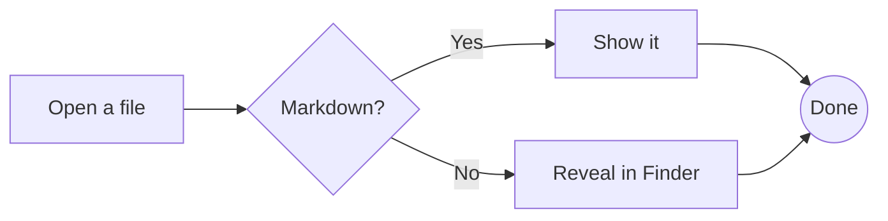
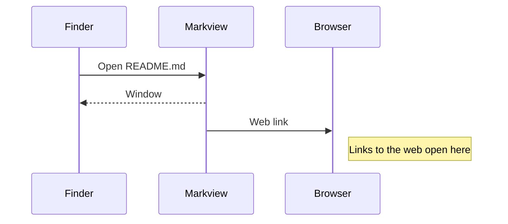
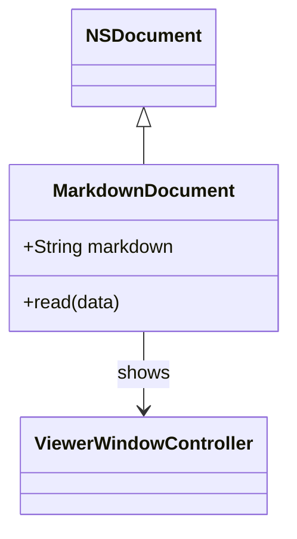
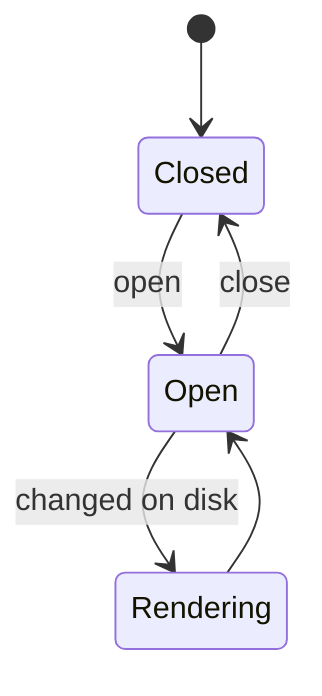
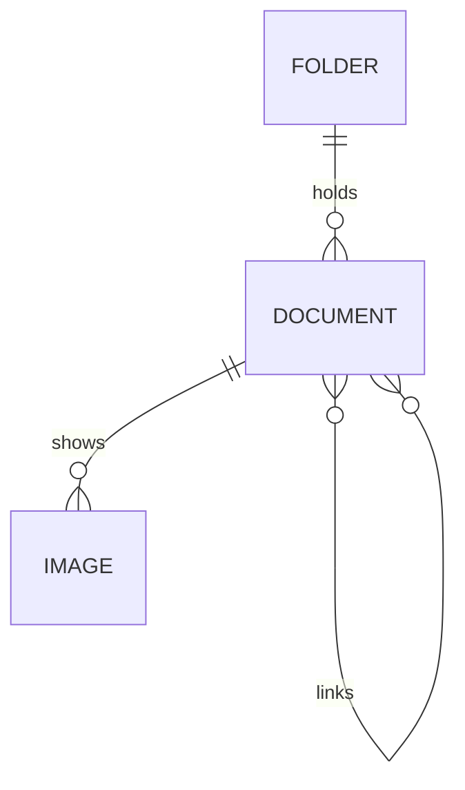
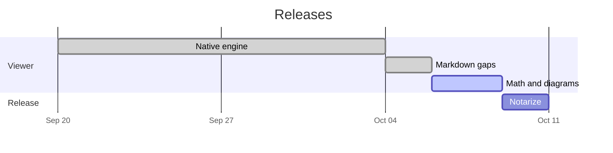
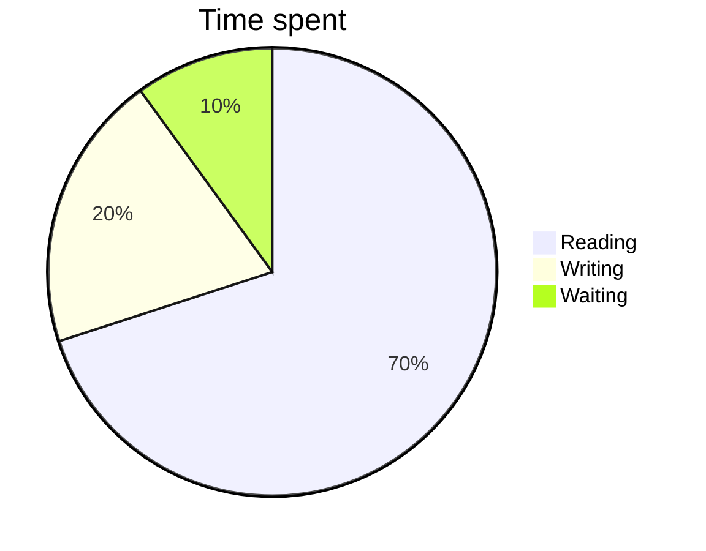
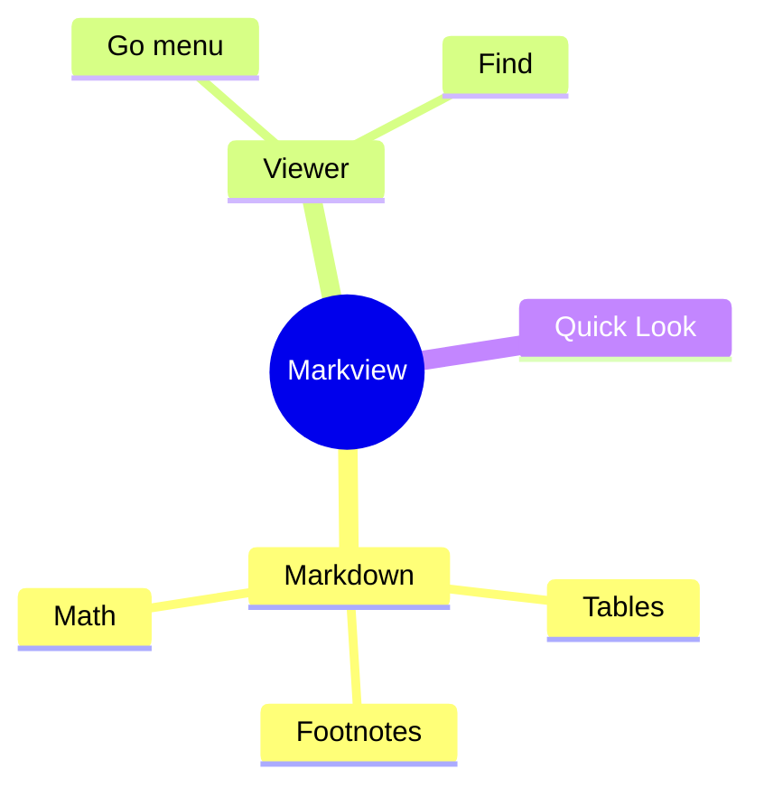

# Diagrams

A `mermaid` code block is drawn as a diagram, natively by MermaidKit, in the light or
the dark colours of the window.

## Flowchart



## Sequence



## Class



## State



## Entity relationship



## Gantt



## Pie



## Mind map



## A diagram in a quote

> ```mermaid
> graph TD
>     Quote --> Diagram
> ```

## Mistakes

A diagram Mermaid cannot read stays as written:

```mermaid
graph TD
    A -- this arrow goes nowhere
```
