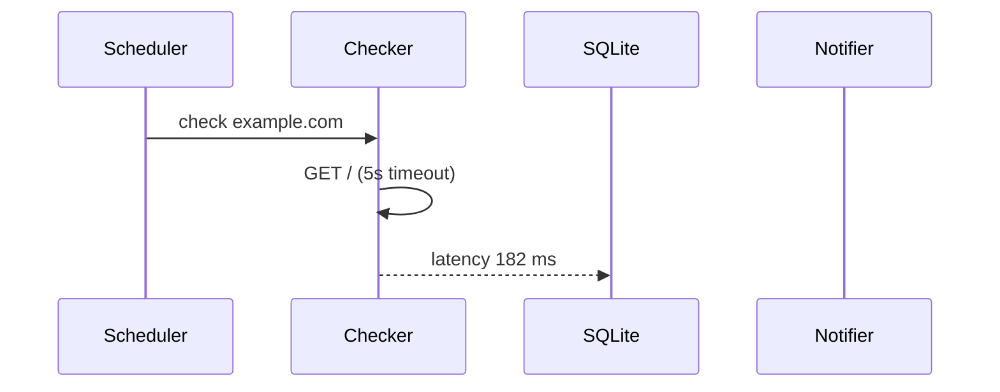

# Maths and diagrams

Markview draws maths and Mermaid diagrams itself, in the colours of the window, with no web view. Copying a formula or a diagram copies its Markdown.

## Maths

Write TeX between dollar signs or in a `math` block, as on GitHub. SwaTex, a Swift version of KaTeX, draws each formula as the document renders, in about 25 µs. Equations number themselves, and `\ce` writes chemistry.

```math
I = \int_{-\infty}^{\infty} e^{-x^2}\,dx = \sqrt{\pi}
```

In Markview, a page of notes with that formula looks like this:


## Diagrams

A `mermaid` block becomes a diagram, drawn by MermaidKit in a few milliseconds. Every Mermaid diagram type works: flowcharts, sequences, classes, states, entity relationships, Gantt charts, pies and mind maps. Click one to open it as a PDF that stays sharp however far you zoom.




> [!NOTE]
> Diagrams follow Mermaid's syntax but MermaidKit's look. A formula or a diagram that cannot be drawn shows as written.
