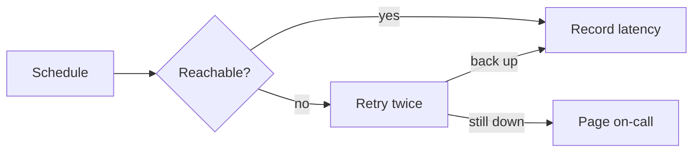

# Lighthouse

A small service that watches your sites and tells you, politely, when one goes dark.
It is one binary and one SQLite file: no queue, no cluster, no dashboard to babysit.

> [!TIP]
> New here? Start with [Getting started](docs/getting-started.md), then read the
> [incident runbook](runbooks/incidents.md) before your first week on call.

## Quick start

```sh
brew install lighthouse
lighthouse watch https://example.com --every 30s --notify slack:#ops
```

## How a check runs



## Settings

| Setting   | Default | What it does                                 |
| --------- | :-----: | -------------------------------------------- |
| `every`   |  `30s`  | Time between two checks of one site          |
| `timeout` |  `5s`   | How long a check waits for an answer         |
| `retries` |   `2`   | Extra tries before a site counts as down     |
| `quiet`   |  `off`  | Hours when only outages over five minutes page |

## Uptime, honestly

Over a window of $n$ checks with $d$ failures, availability is $A = 1 - d/n$, and
a month at "three nines" allows

$$
(1 - 0.999) \times 30 \times 24 \times 60 \approx 43 \text{ minutes}
$$

of downtime. See [the maths of retries](docs/retries.md) for why two retries is enough.

## Roadmap

- [x] HTTP, TCP and TLS-expiry checks
- [x] Slack, email and webhooks
- [ ] A status page you can share
- [ ] Checks from more than one region
