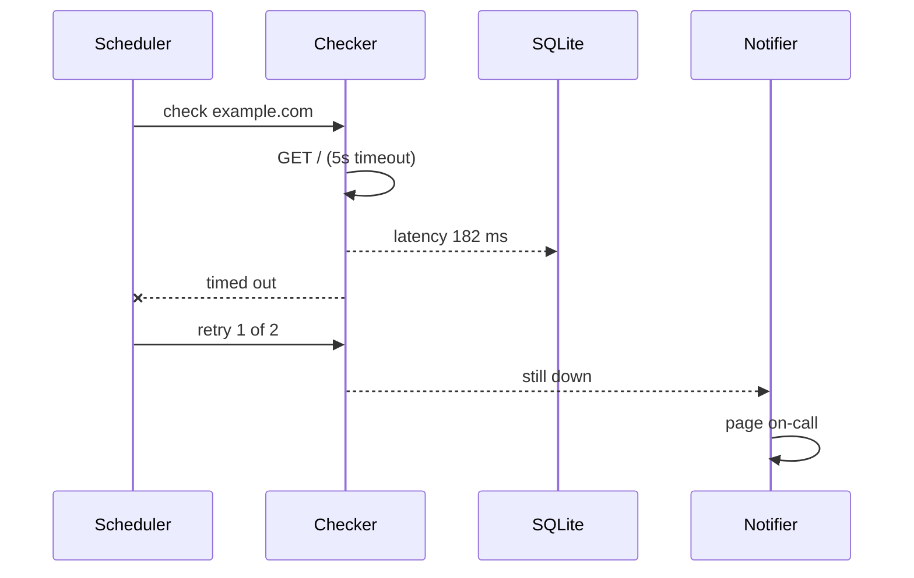
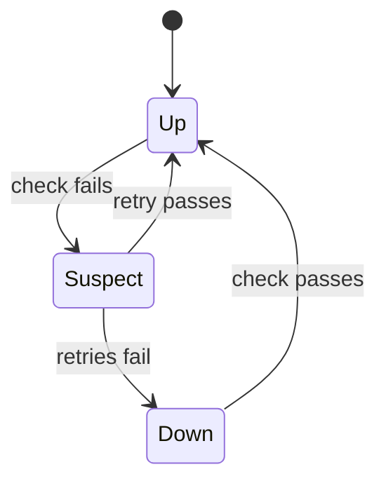

# Architecture

Lighthouse is a scheduler, a pool of checkers and a notifier, sharing one SQLite file.

## A check, end to end



## The life of a site



## Storage

Every result is one row. A year of 30-second checks for 50 sites is about
52 million rows, or 1.4 GB, which SQLite handles without noticing.

```sql
CREATE TABLE results (
  site     INTEGER NOT NULL REFERENCES sites(id),
  at       INTEGER NOT NULL,        -- unix seconds
  latency  INTEGER,                 -- milliseconds, NULL when down
  status   TEXT    NOT NULL CHECK (status IN ('up', 'down', 'suspect'))
);
CREATE INDEX results_site_at ON results(site, at);
```
